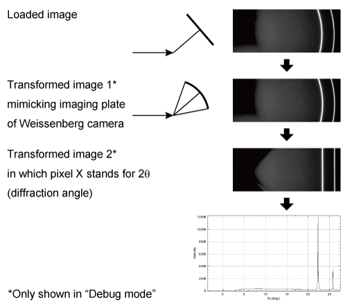

# BL-15A1_XRD
ImageJ plugin for XRD data analysis at KEK-PF BL-15A1.  
Using this plugin, Dectris PILATUS images of synchrotron X-ray diffraction patterns can be loaded and analyzed.  

# Installation
Download BL-15A1_XRD.jar and XRDProps.config from [Releases](../../releases). Create a folder "[ImageJ root]/plugins/BL-15A1_XRD" and place those files in it. Then restart ImageJ.

# How to use

### Plugins > BL-15A1 XRD > Setup PILATUS...
Set necessary parameters before loading XRD patterns.
- **Pixel size X** and **Pixel size Y** are the pixel size of the detector. Default is 0.000172 m = 172 microns for PILATUS 100k.
- **Direct spot position Y** specifies the position of the direct beam in pixels. Open a image with direct beam spot and measure the distance from the top in case two-theta increases to the left or right of the image.
- **Default camera angle** is the two-theta angle of the camera center (i.e. goniometer angle) in degree. It is asked every time you run **Load single PILATUS image...** and this option specifies the default value for the dialog.
- **Camera distance** is the distance from the camera center to the sample.
- **PILATUS direction** specifies the set up of PILATUS detector.
- When converting images, interpolated pixel values are used by default. **Use round() for getPixel()** forces to use nearest neighbour pixel values (no interpolation).
- **Cache file data** allows to store intermediate images for batch job operation.
- With checking **Debug mode**, intermediate images will be displayed. This might also be helpful to understand how this plugin works.
### Plugins > BL-15A1 XRD > Load single PILATUS images...
Select PILATUS image file, and then enter camera angle. The image is loaded and converted to XRD profile (vs. two-theta). The profile is saved as a text file: [PILATUS file name]_vs2q.txt.

### Plugins > BL-15A1 XRD > Convert series of single PILATUS images...
This plugin works on all .tif files in a specified directory. It does not show any camera image or profile, but saves profile text files.
### Plugins > BL-15A1 XRD > Stitch PILATUS images...
It stitches multiple PILATUS images for different camera angles. First, enter the number of images, and then specify the list of camera angles. The plugin askes for the image files of each camera angles. After specifying  all files, the plugin stitches the images and converts it into XRD profile and saves as [First PILATUS images file name]_Stitched_vs2q.txt.

# Reference
See [Y. Takeichi et al.](https://doi.org/10.2355/isijinternational.ISIJINT-2023-215 "Y. Takeichi et al., ISIJ Int. 63, 2017 (2023).") and its supplementary materials for how this plugin is used.
